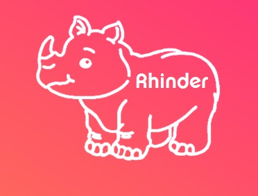

# RHINEX

### Authors

| Name | Affiliation | E-mail |
|:-:|:-:|:-:|
| Marco Zecchini | Sapienza Università di Roma, Rome, Italy | zecchini@diag.uniroma1.it |
| Tommaso Lanciano | Sapienza Università di Roma, Rome, Italy | lanciano@diag.uniroma1.it |
| Matteo Bohm | Sapienza Università di Roma, Rome, Italy | bohm@diag.uniroma1.it |
| Timur Obukhov | Sapienza Università di Roma, Rome, Italy | obukhov@diag.uniroma1.it |
| Maria Antonia Brovelli | Politecnico di Milano, Milan, Italy | maria.brovelli@polimi.it |
| Augusto Mazzoni | Sapienza Università di Roma, Rome, Italy | augusto.mazzoni@uniroma1.it |

### Description

The goal of this project is to provide a webservice able to store and distribute RINEX files. In particular, the user will be able to:

- Authenticate himself through a registration process.
- Upload a RINEX file, with the possibility of integrating it with several additional information.
- Query the database containing RINEX files, with respect in particular to the location and the time of the recording.

### Features

The webservice is implemented using [Django](https://www.djangoproject.com/). For an higher level of abstraction and scalability, the different components of the web service are virtualized into Docker containers. A first prototype is available [here](https://intense-caverns-98162.herokuapp.com/), host in Heroku.

- A user can be recognized as an expert user, and can guarantee for the quality of a single observation of the dataset.
- The metadata structure follows the INSPIRE ISO.
